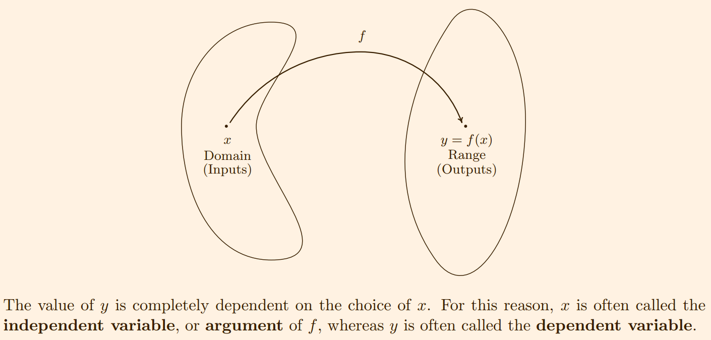
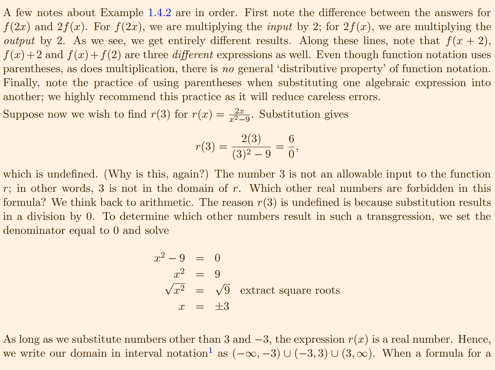
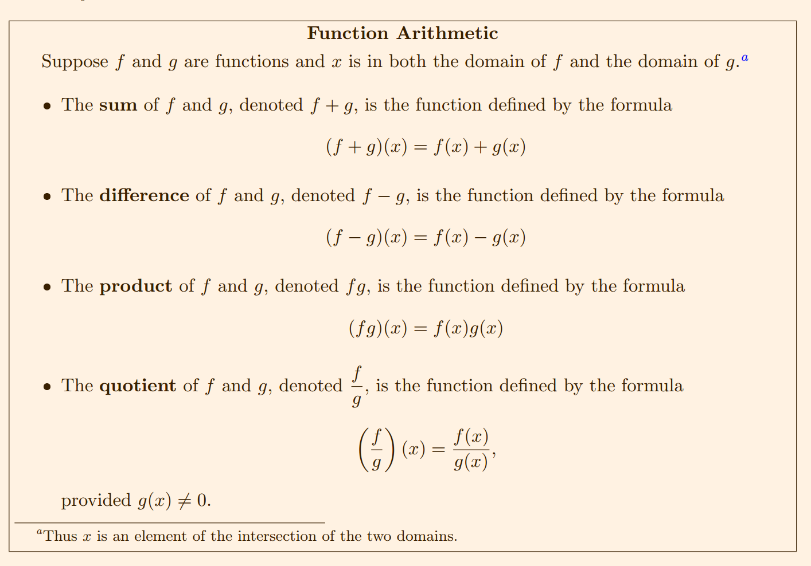

## <span style="color:red;">Introductions to Functions</span>

One of the core concepts in Collecge Algebra is the **function**


Suppose a relation F describes y as a function of x. The sets x- and y-coordinates are given special names which we define below


---

## <span style="color:red;">Function Notation</span>
If we think of the domain of a function as a set of **inputs** and the range as a set of **outputs**, we can think of a function f as a precess by which each input x is matched with only one output y. Since the out is completely determined by the input of the process f, we symbolize the output with **function notation** 'f(x)', read 'f' of 'x'. In other words, f(x) is the output which results by applying the process f to the input x.





When a formula for a function is given, we assume that the function is valid for all real numbers which make arithmetic sense when substituted into the formula. This set of numbers is often called the **implied domain** of the function. At this stage, there are only two mathematical sins we need to avoid: division by 0 and extracting even roots of negative numbers.


---

## <span style="color:red;">Function Arithmetic</span>
The following definitions allow us to add, substract, multiply and divide function using the arithmetic we already
know for real numbers



---

## <span style="color:red;">Graph of Functions</span>


---

## <span style="color:red;">Transformations</span>


## Note

```
Bằng một cách nào đó, một đẳng thức(Equation) có sự xuất hiện của 2 ẩn số x và y. Ta có thể cho ra một tập 
hợp các cặp x và y (gọi là Relation).
ví dụ: ta có các equation sau
3x + y = 2
x^2 + y^2 = 3


Khi ta dồn toàn bộ hằng số và x sang một vế và y sang vế còn lại của đẳng thức. Lúc đó ta có vế chứa x được 
gọi là hàm số(Function). Với một điều kiện, mỗi x tương ứng chỉ cho ra một và duy nhất một y, từ phương trình.
ví dụ: ta có thể sinh ra các hàm số từ đẳng thức sau
3x + y = 2 
=> y = 2 - 3x
=> dự kiến ta đã tìm ra một phương trình là f(x) = 2-3x
Ta có với mỗi x thuộc tập R, thì f(x) chỉ cho ra duy nhất một và chỉ một kết quả y
=> f(x) = 2-3x là một phương trình


Ta gọi x là tham số(Argument) hay các giá trị độc lập(Independent Variable). Còn y được gọi là các giá trị 
phụ thuộc(Dependent Variable).

Lưu ý: Từ điều kiện đã nhắc đến ở trên thì không phải đẳng thức nào cũng ẩn chứa phương trình
ví dụ:
x^2 + y^2 = 0 không thể cho ra phương trình

Ngoài ra không phải với mọi giá trị của x thì phương trình cũng có thể cho ra kết quả y. Bới vì phương trình
cũng bị giới hạn bởi các quy tắc toán học(arithmetic sense). Đẻ phương trình hoạt động bình thường và không vi
phạm các nguyên tắc toán học thì x phải nằm trong một khoảng phạm vi nhất định (gọi là implied domain).


```