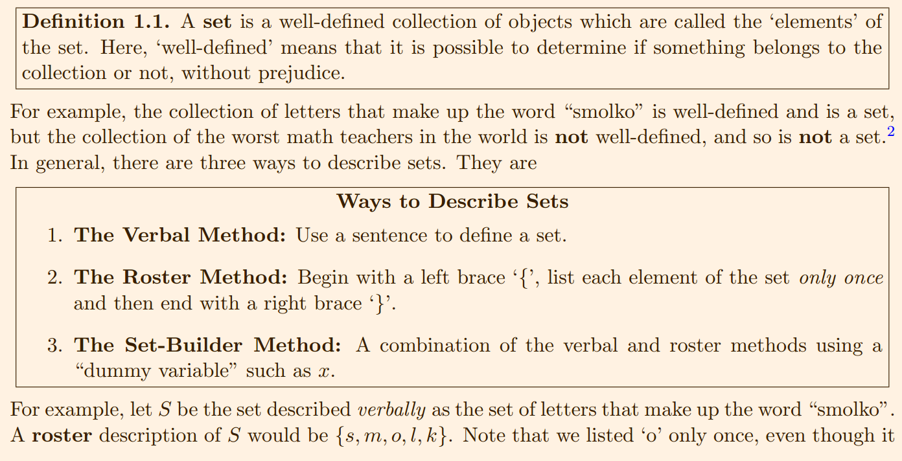
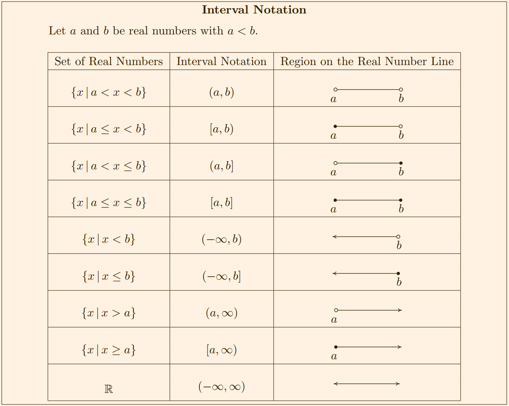

## Sets of Real Numbers and the Cartesian Coordinate Plane
---
### Set of Numbers
Definition of **Set** 

There is some Sets of Number 
 
If we visualize R as a line. Segments of this line are called **intervals** of numbers. **Interval notation* associated with given sets of number 

We will often have to combine sets. There are two basic way to combine set: **intersection** and **union** 

### The cartesian Coordinate Plane
In order to visualize the pure excitement that is Precalculus, we need to unite Algebra and Geometry. Simply put, we must find a way to draw algebraic things
Let's start with possibly the greatest mathematical achievement of all time: the **Cartesian Coordinate Plane**

The horizontal number line is usually called the **x-axis** while the vertical number line is usually called the **y-axis**.
We then describe the point P using the **ordered pair** (2; −4). The first number in the ordered pair is called the **abscissa** or **x-coordinate** and the second is called the **ordinate** or **y-coordinate**.

The axes divide the plane into four regions called **quadrants**. They are labeled with Roman
numerals and proceed counterclockwise around the plane:

One of the most important concepts in all of Mathematics is **symmetry**. There are many types of
symmetry in Mathematics, but three of them can be discussed easily using Cartesian Coordinates.

### Distance in the Plane

## Relations
---
### Graphs of Equations

## Introductions to Functions
---

## Function Notation
---

## Function Arithmetic
---

## Graph of Functions
---

## Transformations
---

